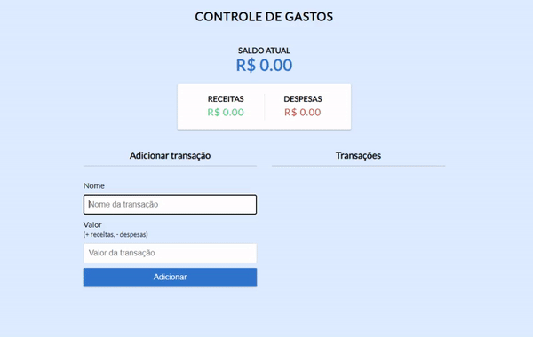
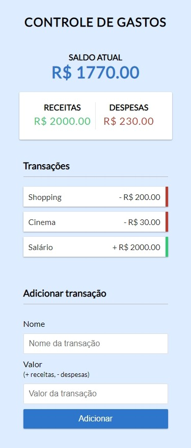

# 💻 CONTROLE DE GASTOS

---

## 🗒️ Sobre o projeto

Controle de gastos é uma aplicação web onde se pode adicionar e remover receitas e despesas do usuário.

Através do formulário, o usuário consegue adicionar receitas e despesas e logo em seguida vê-las na lista de transações. Cada item da lista tem uma borda no canto direito com sua respectiva cor (verde para receitas e vermelha para despesas). 
Um ID único é gerado para cada item de acordo com o length do array, permitindo a exclusão do mesmo e evitando multiplas exclusões por vez. Para excluir, basta posicionar o mouse em cima do item e aparecerá um " X ".

Todos os itens são armazenados no localStorage do navegador, permitindo que permaneçam mesmo havendo um reload ou fechamento da pagina.

CLIQUE AQUI PARA TESTAR

---

## 🛠 Tecnologias

### Frontend:

-   HTML
-   CSS
-   JavaScript

---

## 🎨 Screens

### Web

  

### Mobile

  

